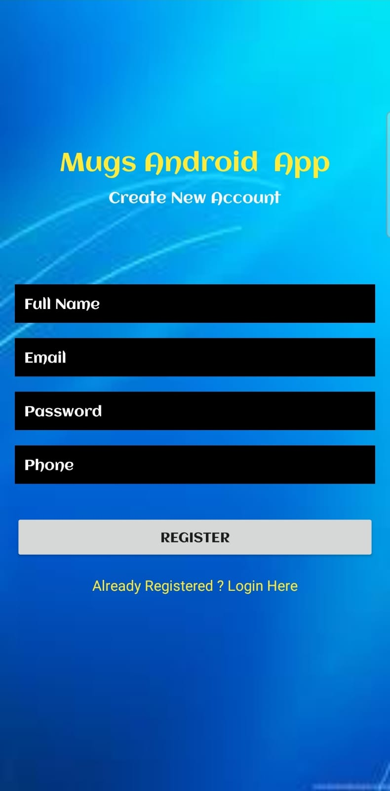
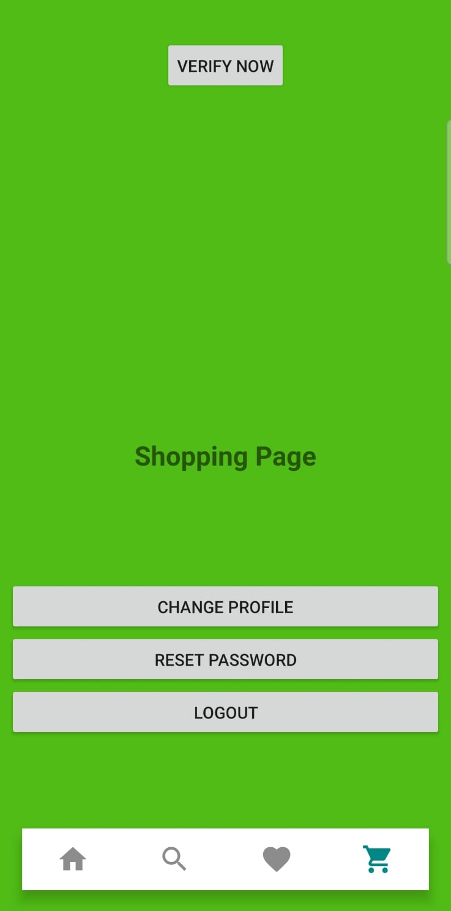
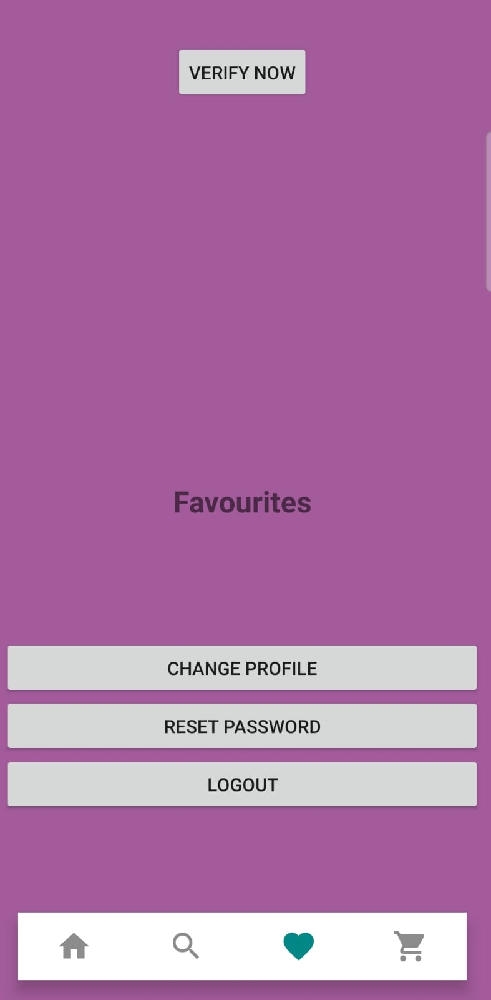
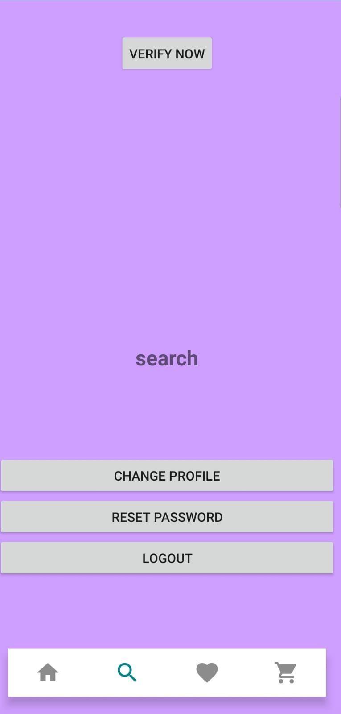
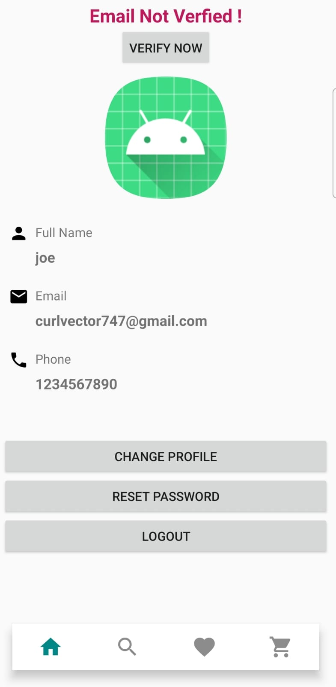

# Mugs-Android-App
In this Android App , user first have to register and then redirected to home page  where user can use all functionality of home page
In this App i made thhis bottom navigation bar by using the concepts of fragments

# Technologies used:-
XML, Java, Android, Firebase

Screenshots
-----------

 

&nbsp;
 
 
 
 

